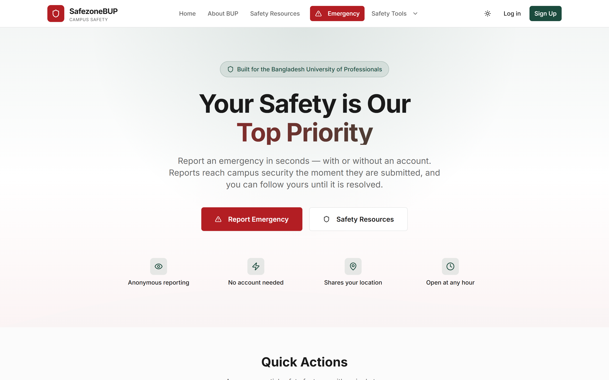
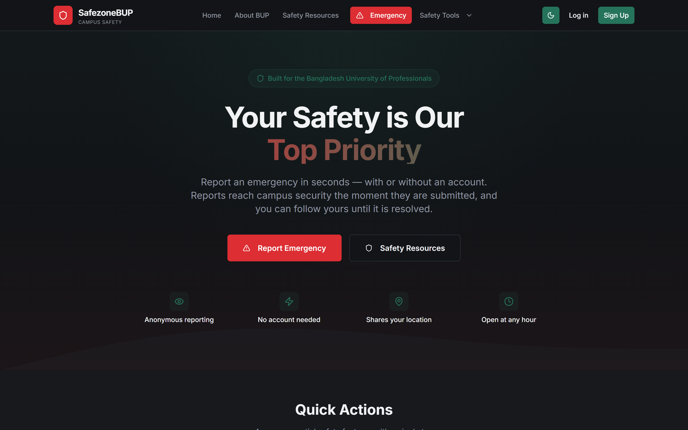
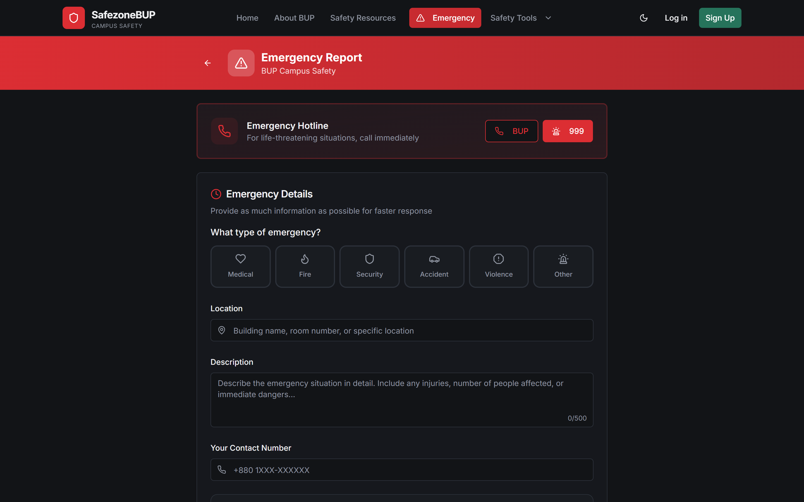
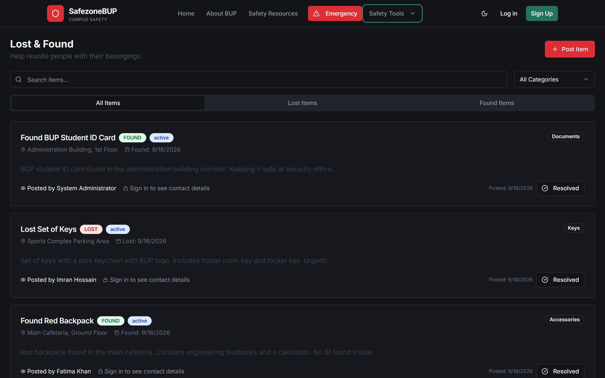

# SafezoneBUP

A campus safety platform for Bangladesh University of Professionals. Students
report emergencies — with or without an account — and campus security is
notified immediately, by email as well as in the app.

[](https://github.com/Hamza-32/SafezoneBUP/actions/workflows/ci.yml)
&nbsp;
&nbsp;
&nbsp;

**[Live deployment →](https://safezone-bup.vercel.app)**



---

## What it does

| | |
| --- | --- |
| **Emergency reporting** | Submit in seconds, signed in or not. Optional GPS. Every responder on duty is notified the moment it lands, and a reference code lets the reporter follow it to resolution. |
| **Safety check-in** | Say where you are going and when you expect to arrive. If you never confirm, responders are told automatically. |
| **SOS** | One control on an active check-in. Latched: once raised it cannot be silently retracted. |
| **Complaints** | Structured filing with optional anonymity and status tracking. |
| **Lost & found** | A public board. Contact details are released only to signed-in users, so it cannot be scraped for phone numbers. |
| **Discussion board** | Moderated, anonymous peer support. |
| **Safety resources** | Verified emergency numbers and campus guidance. |

Two dashboards sit behind it: students see their own reports, staff see
every report with its status. Acting on a report from the dashboard —
assigning it, resolving it, adding a note — is not wired up yet; the
controls are present but inert.

<details>
<summary>More screenshots</summary>

**Dark mode**



**Emergency report**



**Lost and found**



</details>

---

## Design decisions worth explaining

These are the parts of the codebase where the obvious approach was not the
one taken.

**Alerts are delivered, not just recorded.** Writing a row to a
`notifications` table means a responder learns about an emergency when they
next open the dashboard, which at 3am is nobody. `lib/notify.ts` sends email
on top of the database row. Email rather than SMS because SMS has no free
tier, and a mail client raises a phone notification anyway. Delivery is
capped at four seconds and cannot fail the report that triggered it —
refusing to file an emergency because an email provider is down would be a
far worse failure than a late notification.

**Rate limits are shared, and provably so.** In-memory counters are
meaningless on serverless: each instance counts separately and cold starts
reset them, so the real limit is the configured one times however many
instances are alive. Counters live in Redis over its REST API, with no client
library. `npm run verify:ratelimit` proves it against the real store by
clearing the in-memory counters between calls, so anything that still
accumulates had to come back from Redis.

**Degradation is deliberate, everywhere.** No rate-limit store, no email
provider and no error collector each degrade to something that still works,
log the gap on a repeating interval, and never reject a request. A single
line at boot is indistinguishable from a healthy deployment once it scrolls
away, which is how a system ends up silently unprotected.

**Anonymity is enforced server-side.** The API strips any `userId` or `role`
a client sends and takes identity from the session. Self-registration cannot
choose a role. Contact details on the lost and found board are withheld from
anonymous callers by the endpoint, not hidden by the interface.

**Types describe what the API returns, not what is convenient.** A crash in
Lost & Found traced back to a type declaring a nullable field as always
present, so TypeScript never questioned the dereference. Making three such
types honest surfaced two more latent crashes the compiler could then catch.

**No claim in the interface that the code cannot support.** The landing page
once advertised a response time, a user count and real-time tracking. None
were measured and none existed. On a safety page an invented response time is
something a person might rely on.

---

## Stack

Next.js 14 (App Router) · TypeScript · PostgreSQL via Supabase · Tailwind and
shadcn/ui · JWT in an httpOnly cookie · bcrypt · Zod · Redis for shared rate
limiting · Vitest.

Deployed on Vercel. Every third-party service is on a free tier.

---

## Quality

| | |
| --- | --- |
| **53** unit tests | Vitest. No database, no network. |
| **70** security invariants | Role escalation, record ownership, URL handling, rate-limit configuration, endpoint authentication. |
| **44** end-to-end checks | Against a real database. Creates throwaway accounts and removes them. |
| **0** accessibility violations | axe-core, WCAG 2.1 A and AA, across all ten pages. |

```bash
npm test                  # unit tests
npm run verify:security   # invariants, offline
npm run verify:api        # end to end, needs a running server
npm run verify:a11y       # axe-core, needs a running server
npm run verify:ratelimit  # proves the shared rate-limit store works
```

The first two run on every push, alongside typecheck, lint and a production
build, on Node 20 and 22.

Everything asserted in `verify:security` is a rule that was broken at some
point in this repository, so a failure means a regression rather than a style
disagreement.

---

## Security

- Passwords hashed with bcrypt at cost 12; login timing is equalised against
  a decoy hash so a wrong address and a wrong password take the same time
- Session in an httpOnly, `SameSite=Lax`, secure cookie; the user record is
  re-read on every request, so a role change or deletion takes effect at once
  rather than when the token expires
- Every query parameterised; no helper interpolates request data into SQL
- Rate limiting on every user-facing write, keyed per account where the
  endpoint is anonymous to other readers
- A JWT secret that is missing, short, or matches a known template is refused
  outright in production rather than warned about
- Six security headers including a Content-Security-Policy
- Demonstration accounts, which share a published password, cannot be seeded
  into production without an explicit opt-in

---

## Running it

```bash
npm install
cp .env.example .env.local   # set DATABASE_URL and JWT_SECRET
npm run db:init              # schema, migrations and sample data
npm run dev
```

[QUICKSTART.md](QUICKSTART.md) has the five-minute version.
[RUNNING.md](RUNNING.md) covers deployment, the shared rate-limit store,
check-in escalation, alert delivery and error reporting.

---

## Structure

```
app/
  api/            25 route handlers
  error.tsx       error boundaries, which carry the emergency number
components/
  ui/             shadcn primitives
  safety/         check-in, lost and found, resources, discussion
  emergency/      emergency and complaint forms
  dashboards/     student and staff views
lib/
  database.ts             pg pool, with a MySQL-to-PostgreSQL compatibility layer
  api-middleware.ts       auth, authorisation, response helpers
  rate-limit.ts           shared and in-memory limiters
  notify.ts               out-of-band alert delivery
  observability.ts        error reporting
  checkin-escalation.ts   escalates unconfirmed check-ins
  validation.ts           Zod schemas
scripts/                  verification and maintenance
tests/                    Vitest
```

---

## Status

A working prototype, deployed and exercised end to end, not a system a
university currently runs on.

Known gaps, all documented rather than hidden:

- **BUP's own extension numbers are absent.** 999 and the university main
  line are verified against published sources; campus security and medical
  extensions are not published anywhere, and inventing them would be worse
  than omitting them.
- **Check-in escalation needs an external scheduler.** Vercel's free plan
  fires cron once a day, far too coarse. Without one, escalation falls back
  to a sweep when a responder loads the dashboard.
- **`script-src` still allows `'unsafe-inline'`**, because Next.js inlines its
  hydration bootstrap. Tightening it means issuing a nonce from middleware.

---

## Licence

MIT. See [LICENSE](LICENSE).
